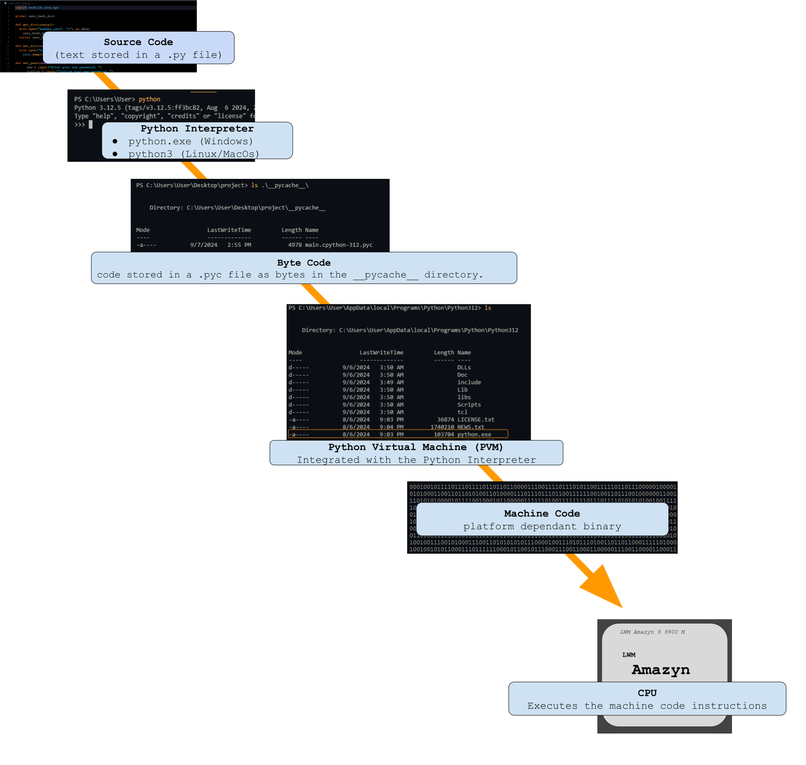

# `Introduction to Python: Comments and Hello World!`
___
Covered in this file:
1. [`Introduction to the Python Programming Language`](#an-introduction-to-the-python-programming-language)
1. [`Single/Multi Line Comments`](#singlemulti-line-comments)
    1. [`Single-line comments`](#single-line-comments)
    1. [`Multi-line comments`](#multi-line-comments-docstrings)
1. [`First Program: Console Output`](#first-program-console-output)
1. [`First Program: User Input`](#first-program-user-input)
1. [`Executing Python Programs`](#executing-a-python-program)
    1. [`How Python Source Code is executed`](#how-python-source-code-is-executed)
    1. [`Executing Your Program`](#executing-your-program)
1. [`Python Installation Path`](#python-installation-path)
    1. [`Python on Windows`](#python-on-windows)
    1. [`Python on MacOs/Linux`](#python-on-linux-or-macos)
1. [`You are Experiencing an Error!`](#you-are-experiencing-an-error)
    1. [`Syntax/Compile Time Errors`](#syntaxcompile-time-errors)
        1. [`Fixing Syntax/Compile Time Errors`](#fixing-syntaxcompile-time-errors)
    1. [`Runtime Errors`](#runtime-errors)
        1. [`Fixing Runtime Errors`](#fixing-runtime-errors)
    1. [`Logical Errors`](#logical-errors)
        1. [`Fixing Logical Errors`](#fixing-logical-errors)

<br>

___

<br>

# `An Introduction to the Python Programming Language!`
## -- `Script Kiddie's First Program:`
### ***Welcome Script Kiddies, to the Python Programming Language***
*As a new programmer you might be refered to as a Script Kiddie.*   
*This is a programmer joke to describe someone who does not know much about programming*  
*Script Kiddies often use code they do not understand written by other programmers, this is ok for now as you will get better as you code more!*  

<br>

Python is a high level interpreted procedural object oriented programming language. Created by Guido van Rossum and first released in 1991, Python's design philosophy emphasizes code readability and simplicity, using significant whitespace to enhance its readability. It supports multiple programming paradigms, including procedural, object-oriented, and functional programming. Python is widely used in various domains, including web development, data analysis, artificial intelligence, scientific computing, and automation.

1994: Python 1.0
* January 1994: Python 1.0 was released, introducing new features like lambda, map, filter, and reduce functions.  

2000: Python 2.0
* October 16, 2000: Python 2.0 was released, introducing list comprehensions, garbage collection, and many other features. This version aimed to improve the language's usability and performance.

2008: Python 3.0
* December 3, 2008: Python 3.0 (also known as Python 3000 or Py3k) was released. This version was designed to rectify fundamental design flaws in the language, leading to some incompatibility with Python 2.x. Key features included:
    * Improved Unicode support.
    * New syntax for print function and integer division.
    * Simplified syntax and consistent behavior.

2020: End of Python 2 Support
* January 1, 2020: Official support for Python 2 ended, marking a significant shift towards Python 3.x.

The current python version and documentation can be found here: [https://www.python.org](https://www.python.org/)  
To install python on your computer start here: [https://www.python.org/downloads/](https://www.python.org/downloads/)


> * Python files have the (.py) extension.   
> * The python interpreter is invoked using the 'python' command on Windows  
>
> * The python interpreter is invoked using the 'python3' command on UNIX like systems (Linux, Mac) 

> * The interpreter can be invoked interactively allowing you to write and execute line by line. 

<br>

Windows command syntax 
> '>' represents the terminal prompt and can be omitted:

    > python

Linux/MacOS command syntax 
> '$' represents the terminal prompt and can be omitted:

    $ python3

<br>

> * The interpreter can be invoked and provided a filepath argument in order to interpret code written in a text file (.py)  

Windows command syntax:

    > python <filepath>

Linux/MacOS command syntax:

    $ python3 <filepath>

Examples:
```
> python main.py  
```
```
$ python3 main.py
```

<br>

*NOTE: <> angle brackets indicate a variable part of the command. For example: \<filepath\> indicates any filepath*  
*NOTE: For simplicity commands with a leading **>** should be understood as Windows Commands unless otherwise specified*  
*NOTE: For simplicity commands with leading **$** should be understood to be Linux/MacOS commands unless otherwise specified*  

> * Now that you have the basics, create a new file that ends in .py, open it in your favorite text editor and let's begin learning about the Python Programming Language.
>
>    * If it is your first time programming I recommend VScode as a text editor you can get it here: [https://code.visualstudio.com/](https://code.visualstudio.com/)

*Current Stable Python Version at the time of writting: Python 3.12.5*

<br>

[Back to Top](#introduction-to-python-comments-and-hello-world)
___

<br>

# `Single/Multi-Line Comments`

Comments are a way for programmers to make notes about thier code.
> * comments are not interpreted as code and are simply ignored by the interpreter.
> * the best programmers write easy to read and well documented (commented) code.
>
> * comments can be used to prevent code from being executed without deleting that code. 

> * use the **#** symbol to make a single line comment
>
> * use a pair of triple single quotes **'''** or triple double quotes **"""** to make a multiline comment called a docstring.

<br>

### `Single-line comments`


```python
# this is a single line comment
# use a '#' hash tag to make a single line comment in python
```

<br>

### `Multi-line comments (docstrings)`
> * Everything between the pair of triple quotes is apart of the comment


```python
'''
use three single quotes to make a multi line comment
called 
a 
docstring
'''

"""
You 
    can 
        also 
            use 
                three 
                    double 
                        quotes 
"""
```

Use Ctrl + / in editors like VScode to make a quick multi-line comment, or to comment out a single line easily

<br>

[Back to Top](#introduction-to-python-comments-and-hello-world)
___

<br>


# `First Program: Console Output`
To build your first program use the built-in ***print( )*** function call to send output to console (called standard output or stdout)

<br>

> Here we will print out "Hello World".   
> Literal text must be written in quotes, and is called a string. 


```python
"Hello World"
```
<br>

> To print out this text we use the built-in function call ***print( )*** with the argument "Hello World"


```python
print("Hello World")
```

<br>

[Back to Top](#introduction-to-python-comments-and-hello-world)
___

<br>


# `First Program: User Input`
To handle input from a user (called standard input or stdin), use the built-in function call ***input( )***.***input( )*** stops the execution of the program, and waits for the user to type in some text, it then returns the text that was entered.

*Note:*  
> When a function like ***input( )*** 'returns' it brings a value back to that point in the program in which the function was called.
> * The caller "*input( )*" then represents the value it returns.

<br>

Here we will print out whatever the user, in this case you, types when prompted for input.  
> We will begin by calling the built-in ***input( )*** function call.


```python
input()
```

<br>

> Placing a string argument inside of the ***input( )*** function call prints out a prompt to tell the user what input to provide.

```python
input("Type your input: ")
```
<br>

> If you place the ***input()*** function call inside of the ***print()*** function call the user input will be output back to the console.

```python
print(input("Type your input: "))
```

<br>

[Back to Top](#introduction-to-python-comments-and-hello-world)
___

<br>


# `Executing a Python Program`

Congrats you have written your first python program! Now, how do you get the computer to run this 'code'?

## `How Python Source Code is executed`
> * What you have just written is called scource code. Scource code refers to the human-readable set of instructions and statements written by a programmer using a programming language.  
> * While it may not seem like it the code that you have just written is not actually readable by the computer.   
> * We will need another program to translate this high-level scource code into another form of code that the computer can understand.   
> 
> * For python this program is the python interpreter.  
>   * Windows: python.exe
>   * Mac/Linux: python3 

<br>



*Having trouble viewing on Github? Try Right-Clicking on the image and selecting "Open image in a new tab"*


||||||||
|:-:|:-:|:-:|:-:|:-:|:-:|:-:|
|Scource Code|-->|Byte Code|-->|Machine Code|-->|Result|
||||||||  
|text|Python Interpreter|Bytes|Python Virtual Machine|Binary|CPU|
||||||||  
|stored in .py file|python.exe (Windows)python3 (Linux/MacOS)|stored in a .pyc file inside of the \_\_pycache\_\_ directory. <br>Is platform independent|PVM|Is platform dependent||Output|
||||||||  

*Python source code is written in text form and stored in a .py file. When this code is executed, it passes to the Python interpreter (python.exe on Windows or python3 on Linux/MacOS), which converts the source code into bytecode. The bytecode is stored in a .pyc file inside the __pycache__ directory and is platform-independent at this stage. The Python Virtual Machine (PVM) then interprets this bytecode and translates it into machine code, which is platform-dependent. Finally, the machine code is processed by the CPU to generate the output.*

<br>

> * Scource code like this is compiled into byte code by the python interpreter.  
>   * Windows: python.exe
>   * Linux/MacOS: python3

> * Then the python virtual machine PVM converts the bytecode into machinecode and the CPU  executes the instructions one by one.

<br>

## `Executing Your Program`
To execute your own Python program:
1. Invoke the interpreter through the command line or python shell and provide your filename as an argument.  
2. Hit ENTER

> Windows Syntax:
```
> python <filename>
```
> Windows Example:
```  
> python main.py 
```
<br>

> Linux/MacOS Syntax:
```
$ python3 <filename>
```
> Linux/MacOS Example:
``` 
$ python3 main.py
```

<br>

*NOTE*: 
> * '>' for Windows, and '$' for Linux/MacOS are used to represent the command prompt. 
>    * These symbols should be omitted when typing the command on your computer.
> * If you are experiencing issues with using the 'python' or 'python3' commands, make sure that the executable has been added to the system path*


<br>


[Back to Top](#introduction-to-python-comments-and-hello-world)
___

<br>


# `Python Installation Path`
You have installed Python, but where can you find it?

<br>

## `Python on Windows`
Python is installed by default here on Windows depending on the version installed.  
    
    C:\Program Files\Python3xx  
    
&nbsp;&nbsp;&nbsp;&nbsp;&nbsp;&nbsp;&nbsp;&nbsp;*where xx indicates the installed version*   

<br>

Python may also be installed here for a specific user: 

    C:\Users\USER\AppData\Local\Programs\Python\Python3xx

<br>
    
To check the current version type the following on the command line interface

    > python --version

<br>
To execute .py files on windows type the following on the command line interface

    > python <filename>

<br>

## `Python On Linux or MacOS`
  
Python is installed by default here on Linux/MacOS depending on the version installed. 
   
    /usr/bin/python3

<br>    

To check the current version type the following on the command line interface

    $ python3 --version

<br>   

To execute .py files on linux and Mac type the following on the command line interface

    $ python3 filename.py

<br>

[Back to Top](#introduction-to-python-comments-and-hello-world)
___

<br>

# `You are Experiencing an Error!`
Oh no... you have done something incorrect and are now experiencing an error. 
Not to worry as a human you are prone to many errors, that we machines don't make.

> To make it easier for you to correct your many PEBKAC and ID 10 T Errors, these errors can be categorized into 3 categories:

|Error|Description|
|:-:|:-|
|Syntax/Compile Time Errors|occur when compiling the code, and the code violates the rules of the programming language's syntax.|
|Runtime Errors|occur after the program has been successfully compiled and started execution. They usually result from operations that are not possible to perform.|
|Logical Errors|occur when a program runs without crashing but produces incorrect results. These errors are caused by mistakes in the program's logic, meaning the code does not behave as intended.|

*Note*:
> * PEBKAC Errors are raised when the Problem Exists Between the Keyboard and Chair.
> * ID 10 T Errors are raised when the issue is caused by the user. 

<br>

# `Syntax/Compile Time Errors`
Syntax/Compile Time errors are typically the easiest errors to fix, and the most common one you humans make. 

<br>

## Fixing Syntax/Compile Time Errors
`STEP ONE: READ THE ERROR OUTPUT!`
- You are looking for two things: a line number, and the specific error info.

<br>

Example:
```python
#lets make a simple Syntax/Compile Time Error
Print("Hello World")

# Output:
# Traceback (most recent call last):
#   File "<path to your .py file>", line 2, in <module>
#     Print("Hello World")
#     ^^^^^
# NameError: name 'Print' is not defined. Did you mean: 'print'?

# Did you find the line number?
# Did you find the specific error info?

# What did I do wrong?
```

<br>

# `
[Back to Top](#introduction-to-python-comments-and-hello-world)Runtime Errors`
___

<br>


Runtime Errors are the second most common errors you humans make.  

Runtime Errors occur when your code is syntatically correct, but you have performed and operation that cannot be performed.

<br>

## Fixing Runtime Errors
`STEP ONE: READ THE ERROR OUTPUT!`
* You are looking for two things: a line number, and the specific error info. 

Example:
```python
#Let's make a simple Runtime Error
print(5 / 0)

# Output:
# Traceback (most recent call last):
#   File "<path to your .py file>", line 1, in <module>
#     print(5 / 0)
#            ~~^~~
# ZeroDivisionError: division by zero

# Did you find the line number?
# Did you find the specific error info?

# What did I do wrong?
```

Example:
```python
#Let's make a simple Runtime Error this is a little more advanced: see lists for more info

my_list = ["a","b","c"]
print(my_list[3])

# Output:
# Traceback (most recent call last):
#   File "<path to your .py file>", line 4, in <module>
#     print(my_list[3])
#           ~~~~~~~^^^
# IndexError: list index out of range

# Did you find the line number?
# Did you find the specific error info?

# What did I do wrong?
```

<br>

[Back to Top](#introduction-to-python-comments-and-hello-world)
___

<br>


# `Logical Errors`
Logical Errors tend to occur with lesser frequency than runtime or compile time errors, but are the hardest to track down.

Logical Errors occur when your code is syntatically correct and all operations are possible, but your code isn't doing what you expect it to do. 

<br>

### Fixing Logical Errors  
`STEP ONE: Debugging!`
* This will be harder than Syntax or Runtime Errors, because you will not get any help from the computer in tracking down the error.
* Learning to use a debugging tool will be the most useful to you, but beginners usually start with print( ) debugging.

<br>

### Lets try an example with a common beginner mistake
*In this problem we will be printing out the first 8 powers of 2*
Here is what we expect:
|2^n|Answer|
|:-:|:-:|
|1| 2|
|2|4|
|3|8|
|4|16|
|5|32|
|6|64|
|7|128|
|8|256|

<br>

### Let's write the code:


```python
print(2 ^ 1) # Output: 3
print(2 ^ 2) # Output: 0
print(2 ^ 3) # Output: 1
print(2 ^ 4) # Output: 6
print(2 ^ 5) # Output: 7
print(2 ^ 6) # Output: 4
print(2 ^ 7) # Output: 5
print(2 ^ 8) # Output: 10
```

That isn't even close to correct, but I didn't get any syntax or runtime errors?
<br>

What is the issue?  
Since we already have print() statements we don't need to add anymore to see what the output of each operation.   

Time to use a search engine or AI tool to help us track down the problem.<br>   
It looks like the operator we used '^' is not for powers, but for something called a bitwise XOR operation.   
That's why our code was not working!.  

<br>

### Let's try again using the correct operator:


```python
print(2 ** 1) # Output: 2
print(2 ** 2) # Output: 4
print(2 ** 3) # Output: 8
print(2 ** 4) # Output: 16
print(2 ** 5) # Output: 32
print(2 ** 6) # Output: 64
print(2 ** 7) # Output: 128
print(2 ** 8) # Output: 256
```

    2
    4
    8
    16
    32
    64
    128
    256
    
<br>

### One More Example:
*This time we will include a little more complicated code*

Lets write a simple program to calculate the area of a rectangle and store that value in a variable.
In this example the width of the rectangle will be determined by dividing the length by 2.

If the length is 5, then the expected width is 2.5, and the area should be 12.5.


```python
length = 5 
width = length  // 2 


area = length * width

print(area) # Output: 10
```

    10
    

We are getting 10 for the area... What is the issue here? There are no syntax errors and no runtime errors.
We need more information, but can't see the calculated value of width. 

<br>

We will use print debugging to help us here, add a print() statement to the code right after the width calculation that shows the value width stores.


```python
length = 5 
width = length  // 2 
print(width) # Output: 2

area = length * width

print(area) # Output: 10
```

The width should be calculated as 2.5, but instead we get 2. So we now know the error is with how we calculate the width value.

<br>

After some research we find that we used the wrong operator to divide.   
Instead of // we should have used / in line 2.


```python
length = 5 
width = length  / 2 

area = length * width

print(area) # Output: 12.5
```

[Back to Top](#introduction-to-python-comments-and-hello-world)
___

<br>


[Back to Top](#introduction-to-python-comments-and-hello-world)
___

<br>
*Created and maintained by Mr. Merritt* 
    
